<div style="background: linear-gradient(135deg, #702A76FF, #2D1348FF); padding: 20px; border-radius: 10px; text-align: center; color: #FDFDFDE4; font-family: JetBrains Mono, monospace;"> <h1 style="margin: 0; font-size: 36px; text-shadow: 2px 2px 4px rgba(0, 0, 0, 0.5);">Astra Interaction System</h1> <p style="margin: 5px 0 0; font-size: 18px; font-style: italic;">A simple, powerful interaction plugin for Unreal Engine</p> </div>
<br>

<em>Welcome to the **Astra Interaction System**, a sleek and intuitive plugin crafted to make object interactions in your Unreal Engine projects a breeze. Whether you're building a first-person adventure or a puzzle game, this tool has you covered with flexible tracing and Blueprint-friendly features.</em>

---

## What Is It?

The Astra Interaction System is a lightweight plugin that lets you detect and interact with objects in your game world using customizable traces. It’s perfect for triggering actions like opening doors, picking up items, or activating switches—all with minimal setup and maximum flexibility.

- **Detect**: Use line, sphere, or box traces to find interactable objects.
- **Interact**: Trigger custom responses via Blueprints with a single delegate.
- **Simplify**: No ticking, no fuss—just pure interaction power.

---

## Features

- **Trace Options**: Choose from line, sphere, or box traces to suit your needs.
- **Blueprint Integration**: Easily bind responses with the `OnInteract` delegate.
- **Customizable**: Adjust distance, shape, and collision channels in the editor.
- **Debug Visualization**: See your traces in action with color-coded feedback.
- **Created by Astra**: A personal touch from a passionate developer.

---

## Installation

1. **Download**: Grab the plugin from the repo using git
```bash
git clone https://github.com/0x00ASTRA/AstraIntractionSystem.git
 ``` 
or Fab (Coming Soon).

2. **Add to Project**: Copy the `AstraInteractionSystem` folder into your project’s `Plugins` directory.

3. **Enable**: In the Unreal Editor, go to `Edit > Plugins`, search for "Astra Interaction System," and enable it. Restart the editor when prompted.

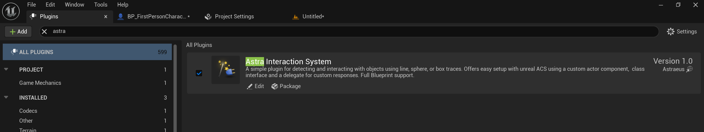  
*Screenshot: Enabling the Astra Interaction System in the Plugins menu.*

---

## Quick Start

### 1. Add the Component
Attach the `UInteractionComponent` to any actor (e.g., your player character).

1. Open your actor’s Blueprint in the editor.
2. Click `+ Add Component` and search for "Interaction Component."
3. Add it to your actor.

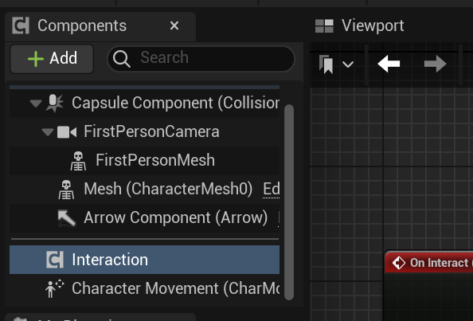  
*Screenshot: Adding the Interaction Component to a player character Blueprint.*

---

### 2. Configure the Trace
Customize the trace settings in the Details panel:

- Set `Trace Shape` to `Line`, `Sphere`, or `Box`.
- Adjust `Trace Distance` for range.
- Enable `Show Trace` to visualize it in-game.

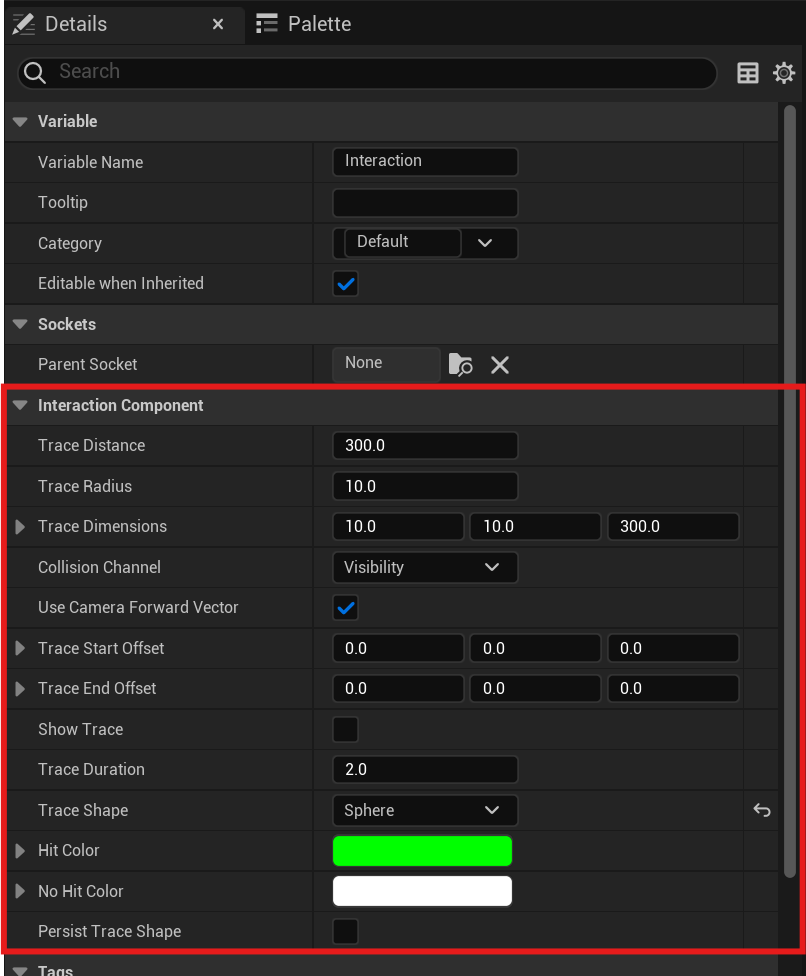  
*Screenshot: Details panel with Trace Shape set to Sphere, Trace Distance at 200, and Show Trace enabled.*

---

### 3. Bind the Interaction
Use Blueprints to respond to interactions:

1. In your actor’s Event Graph, right-click and add an `On Interact` event from the component.
2. Connect it to your custom logic (e.g., print the target’s name).
3. Call `Interact` from an input event (e.g., "E" key press).

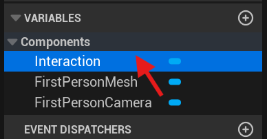

*Screenshot: First Person Character Blueprint details panel showing actor components with the Interaction Component highlighted.

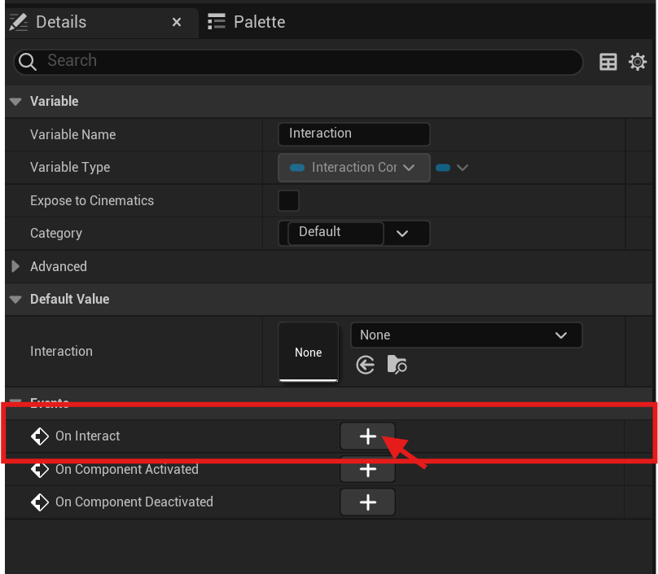

*Screenshot: Details Panel showing the selected Interaction Components delegates with the OnInteract delegate highlighted.

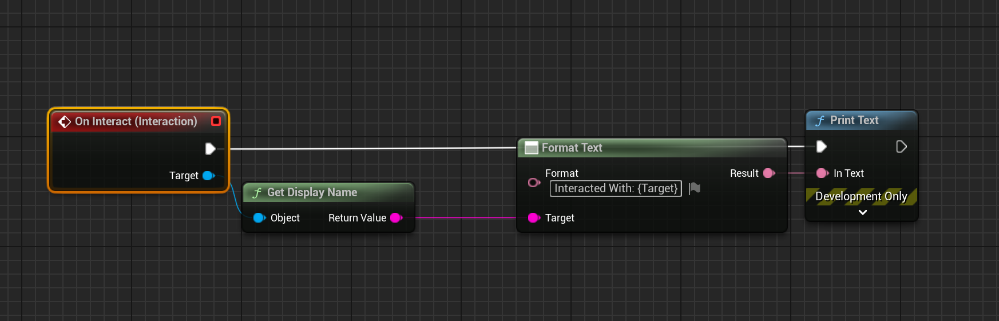

*Screenshot: Blueprint Event Graph showing OnInteract event connected to a Print String node, triggered by an Interact input.*

---

### 4. Test It Out

- Bind an input event to the `Interact` function in the Interaction Component

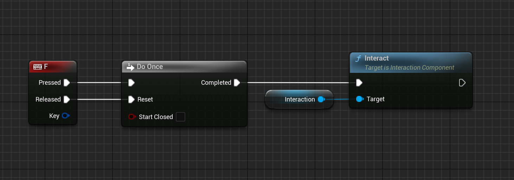

*Screenshot: Blueprint Event Graph binding F keyboard key to Interact function of the Interaction Component.*

- Play in editor and press your input key to see the trace and interaction in action.

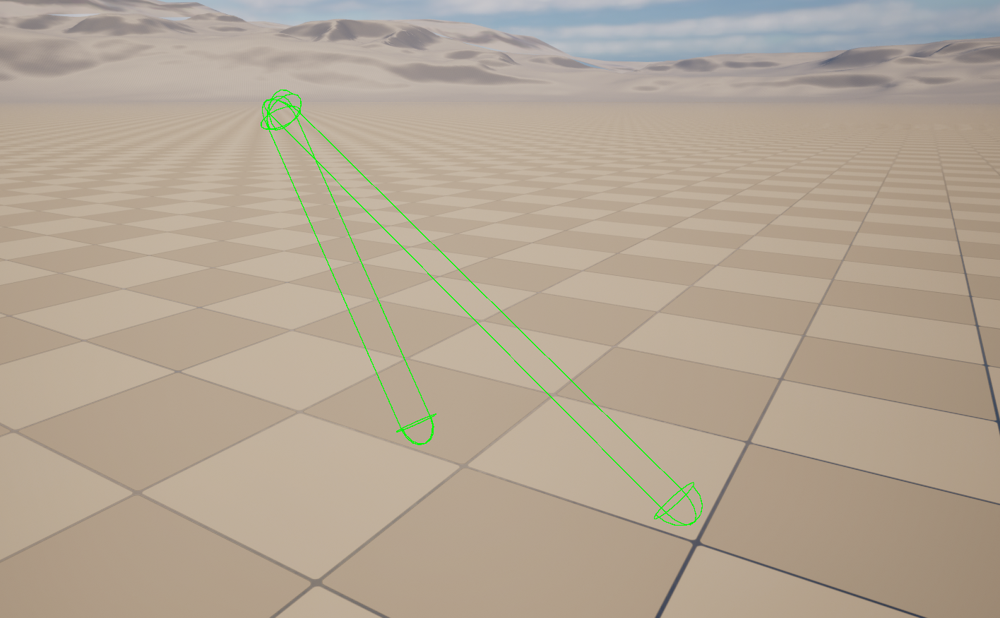  
*Screenshot: In-game view showing a sphere trace hitting an object, with debug visualization and a Blueprint message displayed.*

>*Optional:* 
>- Place an interactable object (e.g., an actor with the `Interactable >Interface`) in your level that has implemented InteractFrom.
>
>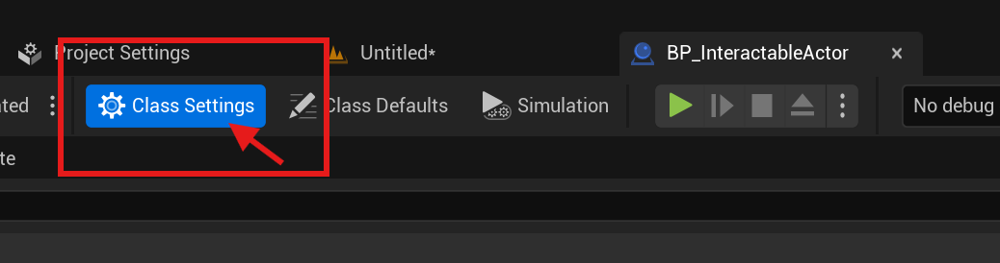
>
>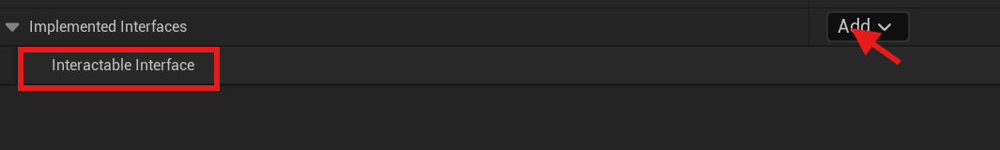
>
>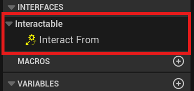
>
>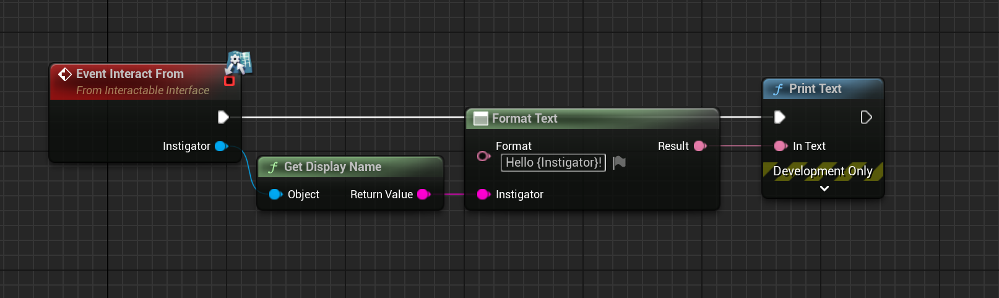

---

## Usage Tips

- **Trace Shapes**: Use `Line` for precision, `Sphere` for area checks, or `Box` for simpler, high-performance area sweeps.
- **Debugging**: Enable `Show Trace` to tweak `Trace Distance` and offsets visually.
- **Interfaces**: Pair with `InteractableInterface` for advanced interaction logic (e.g., doors opening).
- **C++**: All of the code is written in C++ and exposed to blueprints, so you can just include the component header file (AstraInteractionSystem/Source/Public/InteractionComponent.h) and/or implement the interface. Feel free to expand on them for your projects needs.

---

## Contributing

Found a bug or have a feature idea? Feel free to open an issue or submit a pull request. I welcome feedback to make this system even better!

---

## License

This plugin is released under MIT. See the LICENSE file for details.

---

## About the Creator

Hi, I’m Astra! I built this plugin to simplify interaction systems in Unreal Engine, drawing from my own game dev adventures. Hope it helps you bring your worlds to life!
